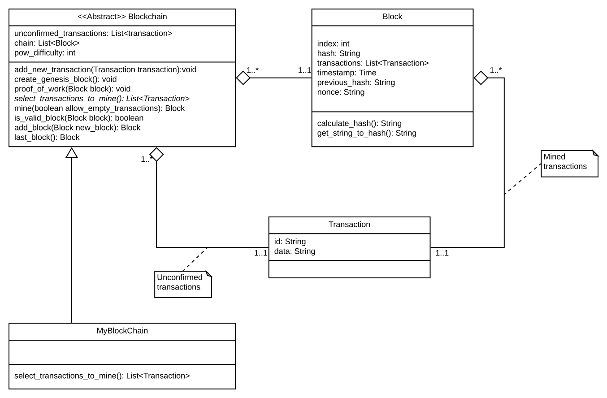

### Blockswarm Project ###

In order to test some algorithms and usefulness of blockchain technology, we are implementing our own simple blockchain. This implementation wil be called **bs_blockchain**.

Main goal is to have a core that guides future developments and tests. To achieve this, we are focusing in developing a comprehensive, scalable arquitecture and in writing rich documentation.

#### Main class diagram ####

This diagram represent the first approach to the core architecture. From here, refactoring is a must to reach an scalable and maintainable system.

  
